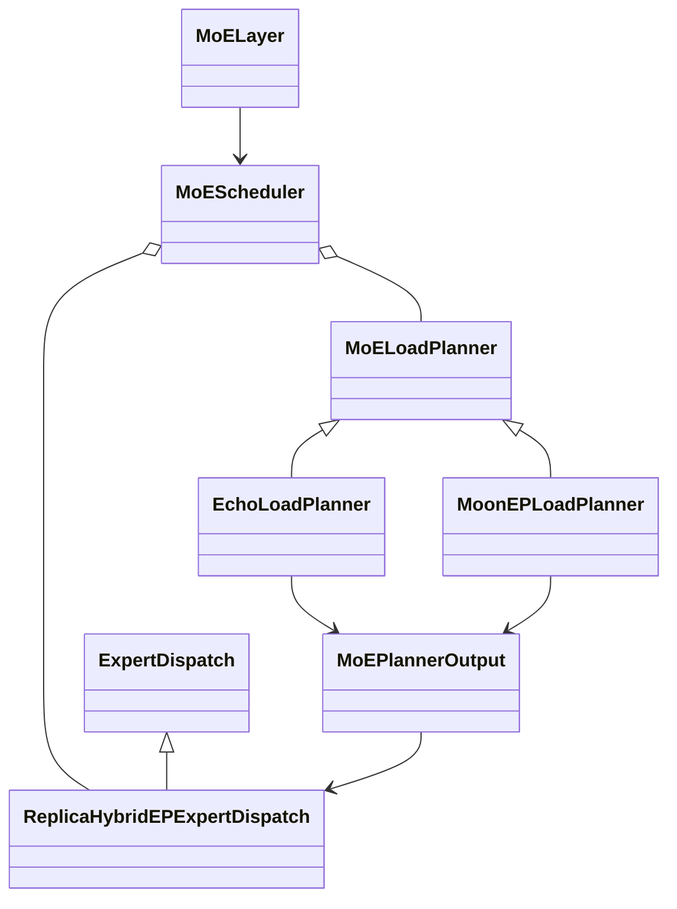

<div align="center">

Megatron-LM & Megatron Core
===========================

<h4>GPU-optimized library for training transformer models at scale</h4>

[](https://docs.nvidia.com/Megatron-Core/developer-guide/latest/index.html)
[](./CHANGELOG.md)
[](./LICENSE)

<div align="left">

> ## 🚨 **DEVELOPMENT BRANCH**
> ⚠️ **EXPERIMENTAL FEATURES** - This is the **dev branch** with experimental features. 
>
> **→ For releases and comprehensive documentation, visit the [main branch](https://github.com/NVIDIA/Megatron-LM)**

## ⚡ Quickstart

```bash
# Clone the dev branch
git clone -b dev https://github.com/NVIDIA/Megatron-LM.git
cd Megatron-LM

# Install from source with dev dependencies (includes transformer_engine)
pip install -e .[mlm,dev]
```

**Megatron Core** is a composable library with GPU-optimized building blocks for custom training frameworks. It provides transformer building blocks, advanced parallelism strategies (TP, PP, DP, EP, CP), mixed precision support (FP16, BF16, FP8, FP4), and model architectures. Best for framework developers and ML engineers building custom training pipelines.

**[Megatron Bridge](https://github.com/NVIDIA-NeMo/Megatron-Bridge)** provides bidirectional Hugging Face ↔ Megatron checkpoint conversion with production-ready recipes.

## Getting Started

**Install from PyPI:**

```bash
uv pip install megatron-core
```

**Or clone and install from source:**

```bash
git clone https://github.com/NVIDIA/Megatron-LM.git
cd Megatron-LM
uv pip install -e .
```

> **Note:** Building from source can use a lot of memory. If the build runs out of memory, limit parallel compilation jobs by setting `MAX_JOBS` (e.g. `MAX_JOBS=4 uv pip install -e .`).

For NGC container setup and all installation options, see the **[Installation Guide](https://docs.nvidia.com/megatron-core/developer-guide/latest/get-started/install.html)**.

- **[Your First Training Run](https://docs.nvidia.com/megatron-core/developer-guide/latest/get-started/quickstart.html)** - End-to-end training examples with data preparation
- **[Parallelism Strategies](https://docs.nvidia.com/megatron-core/developer-guide/latest/user-guide/parallelism-guide.html)** - Scale training across GPUs with TP, PP, DP, EP, and CP
- **[Contribution Guide](https://docs.nvidia.com/megatron-core/developer-guide/latest/developer/contribute.html)** - How to contribute to Megatron Core

# Latest News

- **[2026/03]** **Deprecating Python 3.10 support:** We're officially dropping Python 3.10 support with the upcoming 0.17.0 release. Downstream applications must raise their lower boundary to 3.12 to stay compatible with MCore.
- **[2026/01]** **[Dynamic Context Parallelism](https://developer.nvidia.com/blog/speeding-up-variable-length-training-with-dynamic-context-parallelism-and-nvidia-megatron-core/)** - Up to 1.48x speedup for variable-length sequence training with adaptive CP sizing.
- **[2025/12]** **Megatron Core development has moved to GitHub!** All development and CI now happens in the open. We welcome community contributions.
- **[2025/10]** **[Megatron Dev Branch](https://github.com/NVIDIA/Megatron-LM/tree/dev)** - early access branch with experimental features.
- **[2025/10]** **[Megatron Bridge](https://github.com/NVIDIA-NeMo/Megatron-Bridge)** - Bidirectional converter for interoperability between Hugging Face and Megatron checkpoints, featuring production-ready recipes for popular models.
- **[2025/08]** **[MoE Q3-Q4 2025 Roadmap](https://github.com/NVIDIA/Megatron-LM/issues/1729)** - Comprehensive roadmap for MoE features including DeepSeek-V3, Qwen3, advanced parallelism strategies, FP8 optimizations, and Blackwell performance enhancements.
- **[2025/08]** **[GPT-OSS Model](https://github.com/NVIDIA/Megatron-LM/issues/1739)** - Advanced features including YaRN RoPE scaling, attention sinks, and custom activation functions are being integrated into Megatron Core.
- **[2025/06]** **[Megatron MoE Model Zoo](https://github.com/yanring/Megatron-MoE-ModelZoo)** - Best practices and optimized configurations for training DeepSeek-V3, Mixtral, and Qwen3 MoE models with performance benchmarking and checkpoint conversion tools.
- **[2025/05]** Megatron Core v0.11.0 brings new capabilities for multi-data center LLM training ([blog](https://developer.nvidia.com/blog/turbocharge-llm-training-across-long-haul-data-center-networks-with-nvidia-nemo-framework/)).

<details>
<summary>Table of Contents</summary>

**Getting Started**
- [⚡ Quick Start](#-quick-start)
- [🧠 Dev Branch Philosophy](#-dev-branch-philosophy)
- [MoE Scheduler](#moe-scheduler-experimental)
- [📊 Performance & Benchmarking](#-performance--benchmarking)
- [👥 Community & Support](#-community--support)

**For Complete Documentation** → [Main Branch](https://github.com/NVIDIA/Megatron-LM) | [Official Docs](https://docs.nvidia.com/Megatron-Core/)

</details>


## Dev Branch Philosophy

# Project Structure

```
Megatron-LM/
├── megatron/
│   ├── core/                    # Megatron Core (kernels, parallelism, building blocks)
│   │   ├── models/              # Transformer models
│   │   ├── transformer/         # Transformer building blocks
│   │   ├── tensor_parallel/     # Tensor parallelism
│   │   ├── pipeline_parallel/   # Pipeline parallelism
│   │   ├── distributed/         # Distributed training (FSDP, DDP)
│   │   ├── optimizer/           # Optimizers
│   │   ├── datasets/            # Dataset loaders
│   │   ├── inference/           # Inference engines and server
│   │   └── export/              # Model export (e.g. TensorRT-LLM)
│   ├── training/                # Training scripts
│   ├── legacy/                  # Legacy components
│   ├── post_training/           # Post-training (quantization, distillation, pruning, etc.)
│   └── rl/                      # Reinforcement learning (RLHF, etc.)
├── examples/                    # Ready-to-use training examples
├── tools/                       # Utility tools
├── tests/                       # Comprehensive test suite
└── docs/                        # Documentation
```

# MoE Scheduler (Experimental)

MoE Scheduler addresses load imbalance in dropless MoE models by replicating
hot logical experts into idle physical expert slots and rerouting tokens to the
replicas. It is designed as a preprocessing stage between router output and the
existing Megatron token dispatcher.

The scheduler does not introduce planner-specific branches into the remaining
MoE execution path. After scheduling, `MoELayer` continues through its normal
token preprocessing, dispatch, expert computation, combine, and backward flow.

## Design Goals

- Decouple load planning from expert-weight movement so planners and expert
  dispatch backends can be combined through one contract.
- Keep backend-native state, such as Echo offloading maps and MoonEP replica
  plans, private to concrete implementations.
- Make planners return final token reroute tensors so token dispatchers do not
  need to understand the selected planning algorithm.
- Return the original router output unchanged when the planner gate decides
  that no planning is required.
- Keep the public planner/dispatcher boundary small enough to lower efficiently
  into different expert communication backends.

## Architecture

| Component | Responsibility |
| --- | --- |
| `SchedulerContext` | Carries layer, logical/local expert, EP rank/group, router top-k, training mode, and configuration context. |
| `MoEPlannerOutput` | Unified result containing physical expert placement and final token reroute tensors. |
| `MoELoadPlanner` | Gates planning and converts logical router output into the common physical layout. |
| `ExpertDispatch` | Validates/materializes a physical placement and owns forward/backward lifecycle hooks. |
| `MoEScheduler` | Builds the configured components and orchestrates planning followed by expert materialization. |
| `MoELayer` | Invokes the scheduler between routing and token preprocessing. |

The common planner output is:

```python
@dataclass(frozen=True)
class MoEPlannerOutput:
    # Rank-major physical slot -> logical expert id. -1 marks an unused slot.
    physical_to_logical_map: torch.Tensor

    # Dense [num_tokens, num_physical_experts] rerouted token tensors.
    routing_map: torch.Tensor
    probs: torch.Tensor
```

Every planner must produce this meaning regardless of its native algorithm.
The `ReplicaHybridEPExpertDispatch` consumes `physical_to_logical_map` for every
planner and owns the common weight-prefetch and gradient-reduction lifecycle.

## Class Diagram



## Implemented Components

| Type | Config value | Implementation | Status |
| --- | --- | --- | --- |
| Planner | `echo` | `EchoLoadPlanner` | CUDA/Triton assignment and token reroute aligned with Echo PR #2368. |
| Planner | `moon_ep` | `MoonEPLoadPlanner` | PR #6892 fused per-step placement: one cooperative kernel with symmetric-memory histogram exchange. |
| Expert dispatch | `replica_hybridep` | `ReplicaHybridEPExpertDispatch` | PR #6892 symmetric-memory weight push and per-projection backward reduction, generalized to `E + R`. |

UltraEP is a planned integration. It should implement the same common planner
output or expert-dispatch input semantics instead of exposing UltraEP-native
metadata in the public interface.

## Execution Flow

1. The dispatcher wraps the MoE layer input when backward work must complete
   after router, shared-expert, and latent-projection backward.
2. The router produces logical-expert `probs` and `routing_map`.
3. `MoELayer` calls `MoEScheduler.schedule()`.
4. `MoELoadPlanner.should_plan()` decides whether scheduling is needed.
5. If planning is skipped, the original router tensors are returned unchanged.
6. Otherwise, the planner returns `physical_to_logical_map` and final physical
   `routing_map`/`probs` in `MoEPlannerOutput`.
7. `ExpertDispatch` lowers the placement map to backend-native metadata and
   materializes replica weights on the destination ranks.
8. The existing token dispatcher consumes the physical routing tensors and
   runs the normal dispatch, expert compute, and combine stages.
9. During backward, `replica_hybridep` starts FC2 reduction directly behind
   its wgrad GEMM, starts pending FC1/FC2 reductions after dispatch backward,
   and waits at the layer input before publishing source gradients.

## Configuration

A minimal Echo configuration is:

```yaml
moe_enable_scheduler: true
moe_scheduler_planner_type: echo
moe_scheduler_expert_dispatcher_type: replica_hybridep
moe_scheduler_num_idle_experts: 4
moe_scheduler_assignment_algorithm: approx_bin_packing
```

For MoonEP, set `moe_scheduler_planner_type: moon_ep`. The current MoonEP
implementation allocates one replica slot for every home expert, so
`moe_scheduler_num_idle_experts` must equal `num_moe_experts`.

All planners use PR #6892's `replica_hybridep` weight bridge. It supports an
`E + R` runtime layout, where `R` is positive and divisible by the EP size.
Every rank owns `E / EP` native experts followed by `R / EP` replica slots. It
requires the HybridEP flex token dispatcher, BF16 execution, TE grouped GEMM
with the operation fuser, and fused gradient accumulation. Weights may be BF16
or native-parameter MXFP8 E4M3; FP4 and other FP8 recipes are rejected. The
weight transport also requires a single NVLink domain and a PyTorch/NCCL build
with working native NCCL symmetric-memory support.

Current constraints:

- Dropless MoE only; expert capacity and capacity padding must be disabled.
- `num_moe_experts` and `moe_scheduler_num_idle_experts` must be divisible by
  the expert-model-parallel size.
- `add_bias_linear` must be disabled.
- The `replica_hybridep` expert dispatcher requires discrete native expert
  weights and the Transformer Engine operation fuser; single grouped expert
  weights are unsupported.
- The HybridEP flex token dispatcher requires a build with HybridEP support.
- The MoonEP planner requires CUDA, initialized EP distributed groups, and one
  replica slot per local home expert. Its current #6892 planner uses one fused
  cooperative kernel and an NCCL symmetric-memory histogram window.
- CUDA graph capture is supported only at the whole-MoE scope for
  `replica_hybridep`; separate `moe_router` and `moe_preprocess` scopes are
  rejected. MoE activation recompute is also rejected for this lifecycle.
- When GTP exposes #6892's non-consuming peek protocol, the weight push peeks
  at gathered weights and the expert GEMMs perform the real consume. Older GTP
  implementations retain the pre-existing consume-at-push compatibility path.

Rank 0 logs the configured planner, dispatcher, idle expert count, and
assignment algorithm at startup. The first scheduled forward also logs routing
shapes, physical expert and transfer counts, and whether planning and expert
materialization ran.

## Code Map

| Path | Purpose |
| --- | --- |
| `megatron/core/transformer/moe/moe_scheduler.py` | Shared interfaces, common planner output, and scheduler orchestration. |
| `megatron/core/transformer/moe/echo_moe_scheduler.py` | Echo planner and Triton reroute path. |
| `megatron/core/transformer/moe/moonep_moe_scheduler.py` | MoonEP/PR #6892 planner adapter and common-IR conversion. |
| `megatron/core/transformer/moe/moonep_replica_triton.py` | #6892 fused histogram, placement, and route-mapping Triton kernel. |
| `megatron/core/transformer/moe/replica_hybridep_expert_dispatch.py` | Adapter from common placement maps to ReplicaWeightBridge lifecycle operations. |
| `megatron/core/transformer/moe/replica_planner.py` | Planner-independent `ReplicaWeightBridge`, GTP compatibility, and autograd lifecycle. |
| `megatron/core/transformer/moe/replica_weight_triton.py` | #6892 weight transport and projection-selective gradient-reduction kernels, generalized to variable replica slots. |
| `megatron/core/transformer/moe/moe_layer.py` | Integration between logical routing and the existing token dispatcher. |
| `megatron/core/transformer/transformer_config.py` | Scheduler configuration and compatibility validation. |
| `tests/unit_tests/transformer/moe/test_moe_scheduler.py` | Common contract and orchestration tests. |
| `tests/unit_tests/transformer/moe/test_echo_moe_scheduler.py` | Echo planner, unified replica dispatch, and `MoELayer` integration tests. |
| `tests/unit_tests/transformer/moe/test_moonep_moe_scheduler.py` | MoonEP planner and cross-component compatibility tests. |

## Extending MoE Scheduler

To add a planner:

1. Subclass `MoELoadPlanner` and implement `plan()` and, when needed,
   `should_plan()`.
2. Convert native planner state into `physical_to_logical_map`, dense physical
   `routing_map`, and dense physical `probs` before returning.
3. Register the planner in `MoEScheduler.from_config()` and
   `TransformerConfig` validation.
4. Add contract tests and at least one planner/dispatcher compatibility test.

To add an expert dispatcher:

1. Subclass `ExpertDispatch` and implement `supports()` and `dispatch()`.
2. Consume the common placement map and keep native communication metadata
   private to the backend.
3. Materialize weights before token dispatch and implement backward gradient
   propagation or reduction for replicated experts.
4. Override `wrap_layer_input()` when completion must be ordered after router
   or shared-expert backward.
5. Register the backend and add matched forward/backward correctness tests.

Run the focused unit tests from the Megatron-LM repository root:

```bash
pytest tests/unit_tests/transformer/moe/test_moe_scheduler.py \
  tests/unit_tests/transformer/moe/test_echo_moe_scheduler.py \
  tests/unit_tests/transformer/moe/test_moonep_moe_scheduler.py
```

# Performance Benchmarking

For our latest performance benchmarking results, please refer to [NVIDIA Megatron Bridge Performance Summary](https://docs.nvidia.com/nemo/megatron-bridge/latest/performance-summary.html).

Our codebase efficiently trains models from 2B to 462B parameters across thousands of GPUs, achieving up to **47% Model FLOP Utilization (MFU)** on H100 clusters.


**Benchmark Configuration:**

- **Vocabulary size**: 131,072 tokens
- **Sequence length**: 4096 tokens
- **Model scaling**: Varied hidden size, attention heads, and layers to achieve target parameter counts
- **Communication optimizations**: Fine-grained overlapping with DP (`--overlap-grad-reduce`, `--overlap-param-gather`), TP (`--tp-comm-overlap`), and PP (enabled by default)

**Key Results:**

- **6144 H100 GPUs**: Successfully benchmarked 462B parameter model training
- **Superlinear scaling**: MFU increases from 41% to 47-48% with model size
- **End-to-end measurement**: Throughputs include all operations (data loading, optimizer steps, communication, logging)
- **Production ready**: Full training pipeline with checkpointing and fault tolerance
- *Note: Performance results measured without training to convergence*

## Weak Scaling Results

Our weak scaled results show superlinear scaling (MFU increases from 41% for the smallest model considered to 47-48% for the largest models); this is because larger GEMMs have higher arithmetic intensity and are consequently more efficient to execute.


## Strong Scaling Results

We also strong scaled the standard GPT-3 model (our version has slightly more than 175 billion parameters due to larger vocabulary size) from 96 H100 GPUs to 4608 GPUs, using the same batch size of 1152 sequences throughout. Communication becomes more exposed at larger scale, leading to a reduction in MFU from 47% to 42%.


# Roadmaps

### Fast Iteration
- **Streamlined Review**: 1 code owner + 1 dev approver (can delegate review) + CI/CD

### Feature Lifecycle (Coming Soon)
- **6-Month Timeline**: Experimental features must graduate to stable or be deprecated
- **Migration Support**: Assistance provided for feature transitions

### Stability Expectations
- **Experimental Nature**: Features may change or be removed as development progresses
- **Testing**: All features will pass convergence and performance validation before inclusion
- **Support**: Dev branch issues should include `[DEV]` prefix

# Resources

## Performance & Benchmarking

- 🚀 [2025/11] [Optimizing DeepSeek-V3 Training Performance on NVIDIA GB200 NVL72](docs/discussions/deepseek-v3-gb200-optimization/deepseek-v3-gb200-optimization.md).
- ⚡ [2025/11] [A Guide to Reproduce DeepSeek-V3 Pre-training Performance on GB200](docs/discussions/deepseek-v3-gb200-optimization/deepseek-v3-gb200-reproduce-guide.md).

## Community & Support

### Getting Help
- 📖 **[Documentation](https://docs.nvidia.com/Megatron-Core/)** - Official documentation
- 🐛 **[Issues](https://github.com/NVIDIA/Megatron-LM/issues)** - Bug reports and feature requests

### Contributing
We ❤️ contributions! Ways to contribute:

- 🐛 **Report bugs** - Help us improve reliability
- 💡 **Suggest features** - Shape the future of Megatron Core
- 📝 **Improve docs** - Make Megatron Core more accessible
- 🔧 **Submit PRs** - Contribute code improvements

**→ [Contributing Guide](./CONTRIBUTING.md)**

### Citation
```bibtex
@article{megatron-lm,
  title={Megatron-LM: Training Multi-Billion Parameter Language Models Using Model Parallelism},
  author={Shoeybi, Mohammad and Patwary, Mostofa and Puri, Raul and LeGresley, Patrick and Casper, Jared and Catanzaro, Bryan},
  journal={arXiv preprint arXiv:1909.08053},
  year={2019}
}
```
